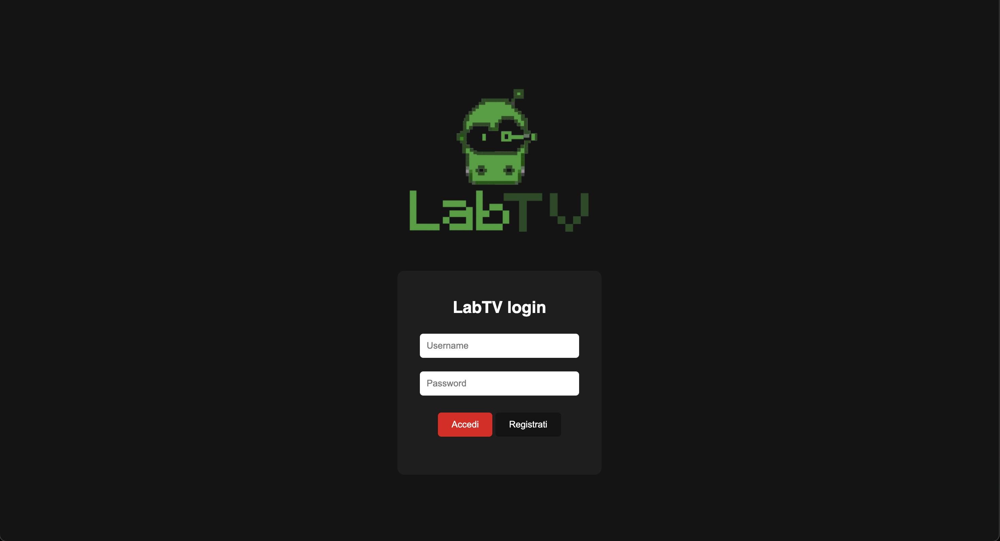
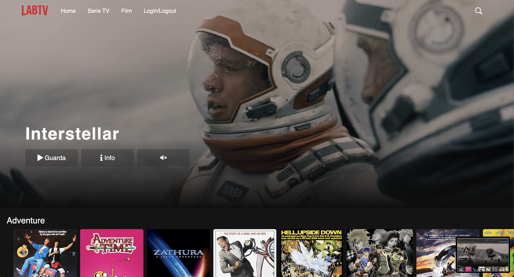
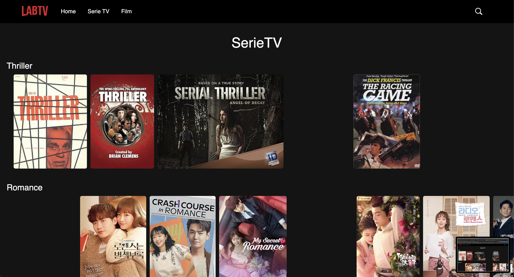

# Streaming Web Project

## 📌 Descrizione del progetto

Progetto accademico sviluppato con **HTML**, **SCSS/CSS** e **JavaScript**, ispirato alle moderne piattaforme di streaming. L’obiettivo è realizzare un'interfaccia responsive e moderna, con funzionalità simulate per la gestione dei contenuti.

---

## 🚀 Funzionalità implementate

* Layout principale in stile piattaforme streaming
* Caroselli orizzontali di contenuti
* Menu di navigazione responsive
* Hover animati e interazioni UI
* Gestione dinamica dei contenuti tramite JavaScript
* Struttura modulare in SCSS

---

## 🛠️ Tecnologie utilizzate

* **HTML5**
* **SCSS / CSS3**
* **JavaScript (ES6)**
* **Git & GitHub**

---

## 📂 Struttura del progetto

```
project-folder/
│  index.html          ← Pagina principale (login o home)
│
├── html/
│   ├── home.html      ← Vecchia homepage
│   ├── film.html
│   └── serieTV.html
│
├── img/
│   ├── close.png
│   ├── image-not-found.png
│   ├── interstellar-poster.png
│   ├── menu.png
│   ├── search-icon.png
│   └── social.png
│
├── js/
│   ├── index.js
│   ├── film.js
│   ├── serieTV.js
│   └── login.js
│
├── scss/
│   ├── style.scss
│   └── parziali/
│       └── (...file SCSS parziali...)
│
├── style/
│   └── (...file CSS generati...)
│
└── video/
    └── interstellar.mp4
```

---

## 🌐 Demo Online

Puoi vedere la demo del progetto direttamente su GitHub Pages:
👉 [https://owen-hub404.github.io/streaming-web-project/](https://owen-hub404.github.io/streaming-web-project/)

---

## 📸 Screenshot







---

## 🤝 Contributi

Questo è un progetto accademico, ma ogni suggerimento o feedback è benvenuto!

---

## 📄 Licenza

Tutti i contenuti sono pubblicati a scopo didattico. Nessun contenuto di piattaforme reali è stato copiato.
